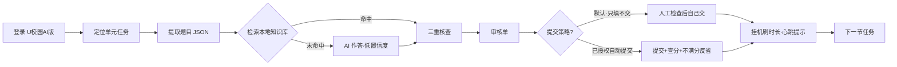

# 🎓 unipus-agent — 让 AI 替你完成 U校园作业

> **一个给 AI 用的 U校园（Unipus AI版）自动作答技能包**：内置 21 个系列 / 约 200 本教材的答案知识库，
> AI 自动定位作业 → 检索答案 → 三重核查 → 回填页面 → 挂机刷学习时长。
> 安全设计：**默认只填不提交**，每次都先问过你。

    

## ✨ 它能做什么

| 能力 | 说明 |
| --- | --- |
| 🔍 **答案知识库** | 微信公开答案文章全量转录为 Markdown：新视野（三/四版）、新标准、新编（第四版）、新一代、思辨、现代大学英语、研究生英语等 21 系列，按「单元→小节→题号」组织，grep 即得 |
| 🎯 **自动定位作业** | 登录 → 课程 → 教程 → Unit → 小节任务，全程浏览器语义动作，不逆向接口 |
| ✍️ **拟人化作答** | 逐题回填、≥1.5s 节流、随机抖动，避免「机器人式瞬完」触发风控 |
| ✅ **三重核查** | 知识库比对 + 代入通顺性检查 + 独立复核，输出审核单；低置信度自动拒绝提交 |
| ⏳ **挂机刷时长** | 每节默认停留 10 分钟（可配），轻量滚动模拟真实学习，每分钟心跳提示「非故障」 |
| 🔒 **提交要你点头** | 默认只填不交；自动提交需当场授权 + 命中率门槛，不满分自动反省（封顶 3 次防风控） |
| 🧩 **自扩充知识库** | 爬取→下载→视觉转录→质检 全流水线文档化，任何 AI 会话可照着把剩余教材补齐 |

## ⚙️ 工作原理



## 🔌 接入任意 AI（三种方式，宿主无关）

本技能的资产只有两类：**Markdown 手册**（给 AI 读的流程与纪律）和**纯 JS 页面回调**（标准浏览器
evaluate 语法，零依赖）。任何能操作浏览器、能读本地文件的 AI 都能用：

| 你的环境 | 接入方式 |
| --- | --- |
| 支持 Agent Skills 标准（Claude Code / ZCode / Codex CLI…） | 整个目录拷进技能目录即装即用（`~/.claude/skills/unipus` 或 `~/.agents/skills/unipus`） |
| 有规则文件但无技能机制（Cursor / Cline / Windsurf…） | 把 [agent-integration.md](references/agent-integration.md) 里的现成片段粘进 `AGENTS.md` / `.cursor/rules` |
| 裸 LLM / 自研 agent / API 编排 | SKILL.md 进 system prompt + 挂任意浏览器 MCP；或直接跑 [scripts/playwright-runner.example.js](scripts/playwright-runner.example.js)（纯 Node + Playwright，无需任何 agent） |

**环境要求**：任意一种浏览器自动化（独立 Playwright / 浏览器类 MCP / 宿主内置浏览器）+
本地文件读取；Python 3.10+ 仅知识库建库工具需要。完整能力清单与各工具映射见
[browser-adapters.md](references/browser-adapters.md)。

首次运行 AI 会问你要 **U校园账号密码**（只在本会话使用，不落盘）以及 **每节停留时长**（默认 10 分钟）。

## 📚 知识库覆盖（节选，完整见 [knowledge/INDEX.md](knowledge/INDEX.md)）

| 系列 | 册数 | 状态 |
| --- | --- | --- |
| 新编大学英语（第四版） | 8 | 🟨 **综合教程1/2/3+视听说教程1 全书32单元已转录 ✅**，其余待源补录 |
| 新视野大学英语（第四版/第三版） | 38+8 | ⏳ 源链接就绪 |
| 新标准大学英语（第二版/第三版） | 16 | ⏳ 源链接就绪 |
| 新一代大学英语 / E英语 / 大学思辨 / 现代大学英语 / 新交际英语 … | 100+ | ⏳ 源链接就绪 |
| 理解当代中国 / 高级英语 / 研究生英语 … | 18 | ⏳ 源链接就绪 |

> ⏳ = 答案源文章链接已索引，按 [references/kb-builder.md](references/kb-builder.md) 十分钟补录一本书的单个单元。

## 🧠 设计原则（吸收自 chaoxing / AutoUnipus / UnipusAI 等优秀前作）

- **知识库优先、AI 兜底**：题库命中率决定提交资格（借鉴 chaoxing 的覆盖率门槛提交）
- **题库 Provider 化 + 随使用增长**（借鉴 chaoxing Provider 模式与本地缓存层）
- **拟人节奏 + 频率冷却**（借鉴 UnipusAI 的 180s 递增冷却）
- **时长均分到节 + 倒计时**（借鉴 UnipusAIAutoPlayer 的均分策略）
- **只读浏览器语义动作，不做协议逆向**（借鉴油猴系的风控友好路线）

完整设计笔记与致谢见文末「致敬」。

## ❓ FAQ

**Q: 会被风控/封号吗？**
A: 本技能不逆向接口、复用你自己的登录态、操作带节流、默认不自动提交。但任何自动化都有风险，
请控制在自用范围、避免高频连刷，风险自担（见免责声明）。

**Q: 学习时长会涨吗？**
A: 会。挂机是在真实页面上的真实停留；直接调接口的项目「只进步不进时长」的坑我们已经替你踩过了。

**Q: 答案会填错吗？**
A: 三重核查 + 审核单把关，且默认不提交——提交前你总能人工看一眼。知识库未覆盖的题会明确标注
「AI 兜底·低置信度」。

**Q: 我的教材不在知识库？**
A: 看 INDEX.md 是否有源链接；有链接就能按 kb-builder.md 让 AI 现场补录（单个单元约 10-20 分钟）。

## 🛠️ 仓库结构

```
├── SKILL.md               # AI 技能入口：纪律红线 + 路由表 + 流程速览
├── references/            # 10 份分场景手册（登录/作答/核查/时长/提交/建库/踩坑/任意agent接入…）
├── scripts/               # 页面回调脚本（宿主无关）+ Playwright 独立运行示例
├── knowledge/             # 答案知识库（Markdown，AI 可检索）
│   ├── INDEX.md           # 21 系列 / 约 200 本总索引
│   └── 新编大学英语（第四版）/…
├── tools/                 # 建库流水线：目录爬取 / 图片下载 / 质量校验
└── docs/screenshots/      # 界面结构存证
```

## ⚠️ 免责声明

- 本项目仅供**个人学习交流**，答案知识库来自公开网络整理，请以「核对自学」心态使用；
- 请遵守所在学校与平台的相关规定，因使用本项目产生的任何后果由使用者自担；
- 禁止用于商业代做、批量账号等场景；
- 项目与外研社/Unipus 官方无任何关联。

## 🙏 致敬

设计吸收了以下开源项目的经验（调研于 2026-09）：

- [Samueli924/chaoxing](https://github.com/Samueli924/chaoxing) — 题库 Provider 模式、覆盖率门槛提交
- [CXRunfree/AutoUnipus](https://github.com/CXRunfree/AutoUnipus) — U校园自动化双模式
- [Zzj-klwgxdz/UnipusAI](https://github.com/Zzj-klwgxdz/UnipusAI) — 频率冷却、模块分层
- [uxudjs/UnipusAIAutoPlayer](https://github.com/uxudjs/UnipusAIAutoPlayer) — 时长均分策略
- [NealJun/unipus](https://github.com/NealJun/unipus) — 油猴路线的风控友好思路

## 📄 License

[MIT](LICENSE) © 2026 Han-maker-wp
